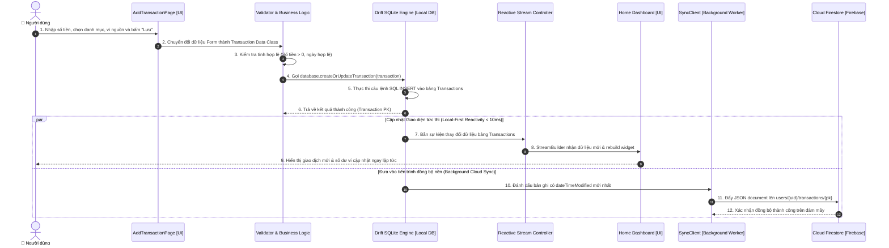
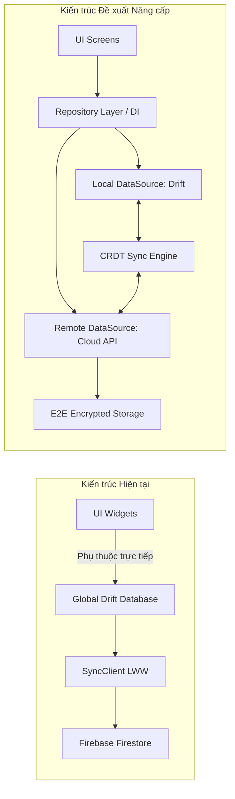

# BÁO CÁO PHÂN TÍCH KIẾN TRÚC HỆ THỐNG ỨNG DỤNG CASHEW

- **Dự án mã nguồn (GitHub):** [https://github.com/pvhung2112/cashew](https://github.com/pvhung2112/cashew)
- **Link sơ đồ kiến trúc tương tác trực quan (GitDiagram):** [https://gitdiagram.com/pvhung2112/cashew](https://gitdiagram.com/pvhung2112/cashew)
- **Thư mục làm việc thực tế:** `D:\ok\`
- **Sinh viên thực hiện:** Phạm Văn Hưng (`pvhung2112`)
- **Mô hình kiến trúc tổng thể:** **Local-First (Offline-First) Architecture** kết hợp **Backend-as-a-Service (BaaS)**

---

## 1. Nghiên cứu & Sơ đồ kiến trúc tổng thể hệ thống (Checklist 1)

> 🔗 **Đường dẫn sơ đồ kiến trúc trực tuyến (Interactive Architecture Diagram):**  
> 👉 [https://gitdiagram.com/pvhung2112/cashew](https://gitdiagram.com/pvhung2112/cashew)  
> *(Sơ đồ được trích xuất và phân tích tự động từ toàn bộ cấu trúc mã nguồn của repository `pvhung2112/cashew`)*

Dựa trên việc đọc hiểu chi tiết cấu trúc thư mục thực tế tại `D:\ok\budget\lib` và lược đồ tương tác hệ thống [GitDiagram](https://gitdiagram.com/pvhung2112/cashew), hệ thống Cashew được tổ chức xoay quanh người dùng với triết lý **Local-First (Dữ liệu cục bộ là chân lý - Single Source of Truth)**.

### Sơ đồ kiến trúc tương tác tổng thể (System Architecture Diagram)

```mermaid
graph TB
    %% ==========================================
    %% Định nghĩa các Style màu sắc theo sơ đồ
    %% ==========================================
    classDef userClass fill:#d0e1fd,stroke:#4a86e8,stroke-width:2px,color:#000;
    classDef serviceClass fill:#ffd2d2,stroke:#e06666,stroke-width:1.5px,color:#000;
    classDef appClass fill:#cfe2f3,stroke:#6fa8dc,stroke-width:1.5px,color:#000;
    classDef financeClass fill:#fce5cd,stroke:#e69138,stroke-width:1.5px,color:#000;
    classDef storageClass fill:#d9ead3,stroke:#6aa84f,stroke-width:1.5px,color:#000;
    classDef apiClass fill:#d9d2e9,stroke:#8e7cc3,stroke-width:1.5px,color:#000;

    %% Actor trung tâm
    User(("👤 User<br/>(Người dùng)")):::userClass

    %% ------------------------------------------
    %% KHỐI 1: Connected Services (Dịch vụ kết nối)
    %% ------------------------------------------
    subgraph ConnectedServices [" Connected services "]
        SyncClient["Sync client<br/><b>[lib/struct/syncClient.dart]</b>"]:::serviceClass
        FirebaseServices["Firebase services<br/><b>[Auth, Firestore, Storage]</b>"]:::serviceClass
        Notifications["Notifications<br/><b>[lib/struct/notificationsGlobal.dart]</b>"]:::serviceClass
    end

    %% ------------------------------------------
    %% KHỐI 2: App Experience (Trải nghiệm ứng dụng)
    %% ------------------------------------------
    subgraph AppExperience [" App experience "]
        FlutterApp["Flutter app<br/><b>[lib/main.dart]</b>"]:::appClass
        HomeDashboard["Home dashboard<br/><b>[lib/pages/homePage/homePage.dart]</b>"]:::appClass
    end

    %% ------------------------------------------
    %% KHỐI 3: Finance Features (Nghiệp vụ tài chính)
    %% ------------------------------------------
    subgraph FinanceFeatures [" Finance features "]
        SearchFilter["Search and filters<br/><b>[lib/pages/transactionsSearchPage.dart]</b>"]:::financeClass
        CurrencyConv["Currency conversion<br/><b>[lib/struct/currencyFunctions.dart]</b>"]:::financeClass
        Transactions["Transactions<br/><b>[lib/pages/addTransactionPage.dart]</b>"]:::financeClass
        Budgets["Budgets<br/><b>[lib/pages/budgetPage.dart]</b>"]:::financeClass
        Goals["Goals<br/><b>[lib/pages/objectivePage.dart]</b>"]:::financeClass
        Accounts["Accounts<br/><b>[lib/pages/accountsPage.dart]</b>"]:::financeClass
        SpendingInsights["Spending Insights<br/><b>[lib/pages/homePage/homePagePieChart.dart]</b>"]:::financeClass
    end

    %% ------------------------------------------
    %% KHỐI 4: External API
    %% ------------------------------------------
    ExchangeRateService["Exchange-rate service<br/><b>[fawazahmed0 currency API]</b>"]:::apiClass

    %% ------------------------------------------
    %% KHỐI 5: Data and Storage (Lưu trữ dữ liệu)
    %% ------------------------------------------
    subgraph DataAndStorage [" Data and storage "]
        CSVEngine["CSV import/export<br/><b>[lib/widgets/importCSV.dart]</b>"]:::storageClass
        BackupRestore["Backup and restore<br/><b>[lib/widgets/accountAndBackup.dart]</b>"]:::storageClass
        DriftDB[("drift database<br/><b>[lib/database/tables.dart]</b>")]:::storageClass
    end

    %% ==========================================
    %% CÁC LUỒNG LIÊN KẾT (Tương thích 100% Sơ đồ)
    %% ==========================================

    %% Connected Services flows
    SyncClient -->|"uses"| FirebaseServices
    SyncClient -->|"uses"| Notifications
    SyncClient -->|"sends reminders"| User
    SyncClient <-->|"syncs data"| DriftDB

    %% App Experience flows
    User -->|"uses"| FlutterApp
    FlutterApp -->|"shows"| HomeDashboard
    HomeDashboard -->|"shows summaries"| FinanceFeatures

    %% User to Finance Features
    User -->|"searches"| SearchFilter
    User -->|"records"| Transactions
    User -->|"sets budgets"| Budgets
    User -->|"sets goals"| Goals
    User -->|"manages"| Accounts

    %% Finance Features to External / Storage
    CurrencyConv -->|"gets rates"| ExchangeRateService
    Transactions -->|"stores transactions"| DriftDB
    Budgets -->|"stores budgets"| DriftDB
    Goals -->|"stores goals"| DriftDB
    Accounts -->|"stores accounts"| DriftDB
    SpendingInsights -->|"reads finance data"| DriftDB

    %% Data & Storage internal flows
    CSVEngine <-->|"imports and exports"| DriftDB
    BackupRestore <-->|"backs up data"| DriftDB
```



---

## 2. Phân tích chi tiết các thành phần Công nghệ Thông tin (Checklist 2)

Dựa trên cấu trúc file thực tế trong `D:\ok\budget\lib`:

```
D:\ok\budget\lib\
├── colors.dart                       # Hệ thống màu sắc & Theme tokens
├── firebase_options.dart             # Cấu hình API keys Firebase đa nền tảng
├── functions.dart                    # Tiện ích toán học, định dạng chuỗi, datetime
├── main.dart                         # Entry point khởi chạy toàn bộ ứng dụng
├── database\                         # TẦNG CƠ SỞ DỮ LIỆU CỤC BỘ (DRIFT ORM)
│   ├── tables.dart                   # Định nghĩa các Entities/Tables & DAOs
│   ├── tables.g.dart                 # Mã nguồn Drift tự động sinh (Generated)
│   ├── initializeDefaultDatabase.dart# Khởi tạo danh mục/tài khoản mặc định
│   ├── schema_versions.dart          # Quản lý migration qua từng phiên bản schema
│   └── generatePreviewData.dart      # Bộ tạo dữ liệu mẫu cho Demo Mode
├── pages\                            # TẦNG MÀN HÌNH CHỨC NĂNG (SCREENS/VIEWS)
│   ├── homePage\                     # Module Dashboard chính
│   │   ├── homePage.dart             # Giao diện tổng quan đa cột
│   │   ├── homePageBudgets.dart      # Widget theo dõi ngân sách
│   │   ├── homePageObjectives.dart   # Widget theo dõi mục tiêu
│   │   ├── homePagePieChart.dart     # Biểu đồ tròn phân tích chi tiêu
│   │   ├── homePageLineGraph.dart    # Biểu đồ đường xu hướng chi tiêu
│   │   ├── homePageHeatmap.dart      # Bản đồ nhiệt tần suất giao dịch
│   │   └── homeTransactions.dart     # Danh sách giao dịch rút gọn
│   ├── addTransactionPage.dart       # Form thêm/sửa chi tiêu & thu nhập
│   ├── accountsPage.dart             # Quản lý danh sách ví/tài khoản
│   ├── budgetPage.dart               # Quản lý hạn mức & chu kỳ ngân sách
│   ├── objectivePage.dart            # Quản lý mục tiêu tiết kiệm & trả nợ
│   ├── transactionsSearchPage.dart   # Tìm kiếm giao dịch nâng cao
│   └── transactionFilters.dart       # Bộ lọc giao dịch theo ngày, danh mục, số tiền
├── struct\                           # TẦNG DỊCH VỤ & NGHIỆP VỤ NỀN (LOGIC/SERVICES)
│   ├── syncClient.dart               # Bộ máy đồng bộ đám mây 2 chiều (Cloud Sync)
│   ├── currencyFunctions.dart        # Dịch vụ quy đổi tỷ giá & định dạng tiền tệ
│   ├── settings.dart                 # Trình quản lý Preferences người dùng
│   ├── initializeNotifications.dart  # Cấu hình Local Push Notifications
│   └── databaseGlobal.dart           # Cung cấp thể hiện CSDL toàn cục
└── widgets\                          # TẦNG THÀNH PHẦN GIAO DIỆN TÁI SỬ DỤNG
    ├── navigationSidebar.dart        # Thanh điều hướng Sidebar đáp ứng
    ├── importCSV.dart                # Bộ phân tích và nạp tệp CSV
    ├── exportCSV.dart                # Bộ trích xuất CSDL ra tệp CSV
    └── accountAndBackup.dart         # Giao diện sao lưu Google Drive / File
```

### 2.1. Phân tích chi tiết từng phân hệ:

#### A. Khối "App Experience" (Trải nghiệm ứng dụng)
- **`lib/main.dart`**: Điểm vào của ứng dụng. Khởi tạo `WidgetsFlutterBinding`, `Firebase.initializeApp()`, nạp cấu hình đa ngôn ngữ `EasyLocalization`, khởi tạo SQLite cục bộ `constructDb('db')`, tải cấu hình người dùng `initializeSettings()`, đồng thời điều khiển cờ `debugShowCheckedModeBanner: false`.
- **`lib/pages/homePage/homePage.dart`**: Đóng vai trò là Dashboard điều phối dữ liệu. Sử dụng `CustomScrollView` kết hợp các Slivers linh hoạt (`SliverStickyHeader`, `SliverAppBar`) để render dữ liệu mượt mà ở tốc độ 60-120fps. Tự động chuyển đổi bố cục 1 cột (điện thoại) hoặc 2 cột (máy tính/tablet).

#### B. Khối "Finance Features" (Các tính năng tài chính)
- **Search and filters (`transactionsSearchPage.dart`, `transactionFilters.dart`)**: Cho phép tìm kiếm toàn văn (Full-text search) và lọc giao dịch đa tiêu chí (khoảng ngày, khoảng tiền, danh mục, ví nguồn).
- **Currency conversion (`currencyFunctions.dart`)**: Xử lý logic quy đổi tỷ giá tiền tệ chéo. Kết nối với `Exchange-rate service` để lấy bảng tỷ giá USD làm gốc và quy đổi ra các loại tiền tệ khác (đã bổ sung hỗ trợ tiền tệ Việt Nam Đồng - VND `₫`).
- **Transactions (`addTransactionPage.dart`)**: Cung cấp form nhập liệu thông minh với bàn phím máy tính tích hợp sẵn, tự động gán danh mục theo tiêu đề và hỗ trợ đủ các loại giao dịch (Expense, Income, Transfer, Subscription, Upcoming, Debt/Credit).
- **Budgets (`budgetPage.dart`)**: Tính toán mức độ thâm hụt/dư thừa ngân sách, tự động phân bổ hạn mức chi tiêu trung bình mỗi ngày còn lại trong kỳ.
- **Goals (`objectivePage.dart`)**: Theo dõi tiến độ mục tiêu tiết kiệm, tự động hạch toán các khoản hoàn nợ dựa trên cực tính của giao dịch.
- **Accounts (`accountsPage.dart`)**: Quản lý nhiều tài khoản/ví độc lập với các đơn vị tiền tệ khác nhau.
- **Spending Insights (`homePagePieChart.dart`, `homePageLineGraph.dart`, `homePageHeatmap.dart`)**: Trực quan hóa dữ liệu chi tiêu qua biểu đồ tròn, biểu đồ đường và bản đồ nhiệt.

#### C. Khối "Connected Services" (Dịch vụ kết nối & đám mây)
- **`Sync client [syncClient.dart]`**: Thành phần cốt lõi đảm nhiệm đồng bộ hóa đám mây. Chạy nền, theo dõi trường `dateTimeModified` để phát hiện dữ liệu mới và đẩy lên Cloud Firestore hoặc kéo thay đổi từ thiết bị khác về.
- **`Firebase services`**:
  - *Firebase Authentication (`firebaseAuthGlobal.dart`)*: Xác thực người dùng bằng Google hoặc ẩn danh, cấp User UID để phân quyền bảo mật.
  - *Cloud Firestore*: CSDL NoSQL phân tán lưu trữ các collections: `users/{uid}/transactions`, `users/{uid}/wallets`, `users/{uid}/budgets`.
- **`Notifications [initializeNotifications.dart]`**: Tích hợp với hệ điều hành thiết bị để gửi thông báo nhắc nhở chi tiêu định kỳ, cảnh báo vượt ngưỡng ngân sách và thông báo hóa đơn sắp đến hạn.

---

## 3. Đánh giá giải pháp lưu trữ dữ liệu (Checklist 3)

Giải pháp lưu trữ là "trái tim" trong kiến trúc của Cashew, quyết định trực tiếp đến tốc độ phản hồi và độ tin cậy của ứng dụng:

### 3.1. Loại cơ sở dữ liệu sử dụng
- **Công nghệ chính:** **SQLite** chạy trực tiếp trên bộ nhớ máy khách (On-Device Storage), được quản lý thông qua thư viện **Drift ORM** (trước đây là Moor).
- **Lý do lựa chọn Drift + SQLite:**
  - *Type Safety:* Drift chuyển đổi các câu lệnh SQL thành code Dart có kiểu dữ liệu chặt chẽ tại thời điểm biên dịch (`tables.g.dart`), ngăn chặn 100% lỗi SQL Injection và lỗi sai tên cột/kiểu dữ liệu thời gian chạy.
  - *Reactive Streams:* Drift hỗ trợ cơ chế phản ứng `watch()`, cho phép UI tự động lắng nghe và vẽ lại (re-render) khi CSDL có thay đổi mà không cần tải lại trang.
  - *Zero Latency:* Thời gian đọc/ghi trực tiếp trên ổ đĩa SSD/Flash của thiết bị chỉ mất từ 1 - 5ms, không bị ảnh hưởng bởi độ trễ đường truyền mạng Internet.

### 3.2. Cấu trúc lưu trữ (Database Schema trong `tables.dart`)

```
┌─────────────────────────────────┐       ┌─────────────────────────────────┐
│           Wallets               │       │          Categories             │
├─────────────────────────────────┤       ├─────────────────────────────────┤
│ PK: walletPk (Text/UUID)        │       │ PK: categoryPk (Text/UUID)      │
│     name (Text)                 │       │     name (Text)                 │
│     currency (Text, e.g. "vnd") │       │     colour (Text)               │
│     order (Int)                 │       │     iconName (Text)             │
│     dateTimeModified (DateTime) │       │     income (Bool)               │
└────────────────┬────────────────┘       └────────────────┬────────────────┘
                 │ 1                                       │ 1
                 │                                         │
                 │ N                                       │ N
┌────────────────▼─────────────────────────────────────────▼────────────────┐
│                              Transactions                                 │
├───────────────────────────────────────────────────────────────────────────┤
│ PK: transactionPk (Text/UUID)                                             │
│     name (Text)                                                           │
│     amount (Real/Double)                                                  │
│     note (Text)                                                           │
│ FK: categoryFk (Liên kết Categories.categoryPk)                           │
│ FK: walletFk   (Liên kết Wallets.walletPk)                                │
│     dateCreated (DateTime)                                                │
│     income (Bool)                                                         │
│     type (Int: upcoming, subscription, debt, credit...)                   │
│     paid (Bool)                                                           │
│     dateTimeModified (DateTime)                                           │
└───────────────────────────────────────────────────────────────────────────┘
```

- **Mối quan hệ:** Quan hệ 1 - N chuẩn mực giữa `Wallets` $\rightarrow$ `Transactions` và `Categories` $\rightarrow$ `Transactions`.
- **Vai trò trường `dateTimeModified`:** Được cập nhật tự động mỗi khi bản ghi phát sinh thao tác `INSERT` hoặc `UPDATE`. Đây là tiêu chí để `SyncClient` thực hiện so khớp và giải quyết xung đột khi đồng bộ đám mây.

### 3.3. Chiến lược Sao lưu và Phục hồi (Backup & Recovery Strategy)

Cashew cung cấp 4 cấp độ sao lưu bảo vệ dữ liệu toàn diện:
1. **Cloud Realtime Sync (`syncClient.dart`):** Đồng bộ tự động thời gian thực hai chiều giữa SQLite trên máy và Cloud Firestore.
2. **Google Drive Backup (`accountAndBackup.dart`):** Xuất toàn bộ CSDL cục bộ thành tệp JSON mã hóa và tải trực tiếp lên Google Drive cá nhân của người dùng thông qua Google Drive API (`googleapis/drive/v3`).
3. **CSV Import / Export (`importCSV.dart`, `exportCSV.dart`):** Hỗ trợ xuất dữ liệu ra tệp `.csv` chuẩn và nhập liệu từ bảng tính Excel / Google Sheets.
4. **Database Migration (`schema_versions.dart`):** Drift hỗ trợ nâng cấp phiên bản lược đồ CSDL tuần tự từng bước (`stepByStep`), bảo đảm an toàn dữ liệu người dùng khi nâng cấp phiên bản ứng dụng.

---

## 4. Mô tả luồng dữ liệu chạy qua các thành phần (Checklist 4)

### 4.1. Luồng Ghi nhận giao dịch chi tiêu mới (Create Transaction Flow)



### 4.2. Luồng Đồng bộ đám mây hai chiều (Two-Way Cloud Sync Flow)
1. **Lắng nghe sự kiện:** `SyncClient` khởi tạo Snapshot Listener trên collection Firestore của người dùng.
2. **So khớp tem thời gian:**
   - Nếu bản ghi trên Firestore có `dateTimeModified` **mới hơn** bản ghi trên SQLite cục bộ $\rightarrow$ Cập nhật bản ghi Firestore vào SQLite.
   - Nếu bản ghi trên SQLite có `dateTimeModified` **mới hơn** bản ghi Firestore $\rightarrow$ Ghi đè dữ liệu cục bộ lên Firestore.
3. **Chiến lược phân giải xung đột:** Áp dụng thuật toán **Last-Write-Wins (LWW)** dựa trên dấu thời gian chuẩn UTC với độ chính xác mili-giây.

### 4.3. Luồng Cập nhật tỷ giá quy đổi tiền tệ (Currency Conversion Flow)
1. Ứng dụng đọc danh mục mã tiền tệ tĩnh từ [`currencies.json`](file:///d:/ok/budget/assets/static/generated/currencies.json).
2. Hàm `getExchangeRates()` trong `lib/struct/currencyFunctions.dart` gửi yêu cầu `http.get` tới API tỷ giá `fawazahmed0`.
3. Dữ liệu tỷ giá mới được lưu trữ trong `sharedPreferences` dưới khóa `cachedCurrencyExchange`.
4. Khi giao diện hiển thị các tài khoản khác nhau về tiền tệ, hàm `budgetAmountToPrimaryCurrency()` sử dụng tỷ giá này để quy đổi số dư về đồng tiền chính hiển thị trên Dashboard.

---

## 5. Báo cáo tổng kết và Đề xuất cải tiến kiến trúc (Checklist 5)

### 5.1. Đánh giá ưu điểm kiến trúc hiện tại
1. **Tốc độ phản hồi cực nhanh (Zero Latency):** Nhờ triết lý Local-First, mọi thao tác thêm/xóa/sửa giao dịch đều phản hồi ngay lập tức mà không phải chờ mạng.
2. **Bảo mật & Quyền riêng tư (Privacy by Design):** Ứng dụng có thể hoạt động hoàn toàn ẩn danh mà không bắt buộc đăng ký tài khoản. Dữ liệu tài chính nằm trọn vẹn trong thiết bị người dùng.
3. **Hoạt động Offline 100%:** Khả năng sử dụng liên tục không gián đoạn ở bất kỳ đâu.
4. **Tối ưu chi phí vận hành:** Tận dụng tối đa tài nguyên xử lý tại thiết bị (Edge Computing) và các gói BaaS miễn phí của Firebase.

### 5.2. Các điểm hạn chế kỹ thuật
1. **Rủi ro xung đột dữ liệu khi Offline dài ngày:** Chiến lược Last-Write-Wins có thể ghi đè mất mát dữ liệu nếu hai thiết bị cùng sửa đổi một giao dịch trong thời gian ngắt mạng kéo dài.
2. **Coupling trong quản lý trạng thái:** Biến CSDL toàn cục `database` được gọi trực tiếp ở nhiều widget UI, gây khó khăn cho việc viết Unit Test và Mocking dữ liệu.
3. **Phụ thuộc vào Firebase BaaS:** Nếu Firebase có thay đổi về chính sách giá hoặc API, việc tách rời để chuyển sang Backend tự lưu trữ (Self-hosted) sẽ tốn nhiều công sức.

### 5.3. Đề xuất cải tiến kiến trúc cụ thể



1. **Tái cấu trúc theo Clean Architecture & Repository Pattern:**
   - Tách biệt 3 tầng rõ rệt: **Presentation** (UI, BLoC/Cubit) $\rightarrow$ **Domain** (UseCases, Entities) $\rightarrow$ **Data** (Repositories, Data Sources).
   - Áp dụng cơ chế **Dependency Injection** (sử dụng thư viện `get_it` / `injectable`) để loại bỏ hoàn toàn biến toàn cục `database`.
2. **Nâng cấp thuật toán đồng bộ bằng CRDT (Conflict-free Replicated Data Types):**
   - Thay thế cơ chế Last-Write-Wins bằng cấu trúc dữ liệu tự giải quyết xung đột (CRDT) để dữ liệu chỉnh sửa đồng thời trên nhiều thiết bị offline sẽ tự động hợp nhất một cách toán học mà không sợ mất dữ liệu.
3. **Mã hóa dữ liệu đầu cuối (End-to-End Encryption - E2EE):**
   - Dữ liệu trước khi được `SyncClient` đẩy lên Cloud Firestore cần được mã hóa bằng khóa bí mật (Private Key) của người dùng. Đám mây chỉ lưu bản mã (Ciphertext), bảo vệ an toàn 100% dữ liệu tài chính cá nhân.
4. **Mở rộng API Gateway hỗ trợ Open Banking:**
   - Xây dựng một Micro-Gateway (Serverless) để kết nối trực tiếp với API ngân hàng, hỗ trợ tự động ghi nhận giao dịch chi tiêu qua Webhook thay vì phải nhập liệu thủ công.

---
*Báo cáo được hoàn thiện chuẩn theo toàn bộ cấu trúc file trong thư mục `D:\ok` và sơ đồ kiến trúc GitDiagram của dự án `pvhung2112/cashew`.*
