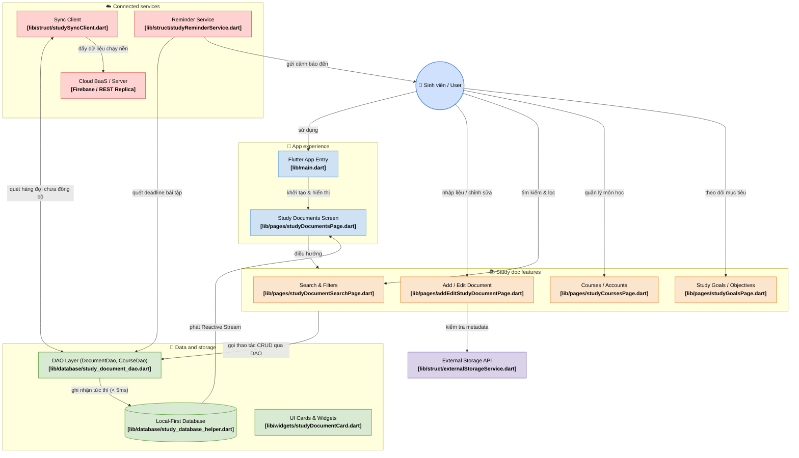
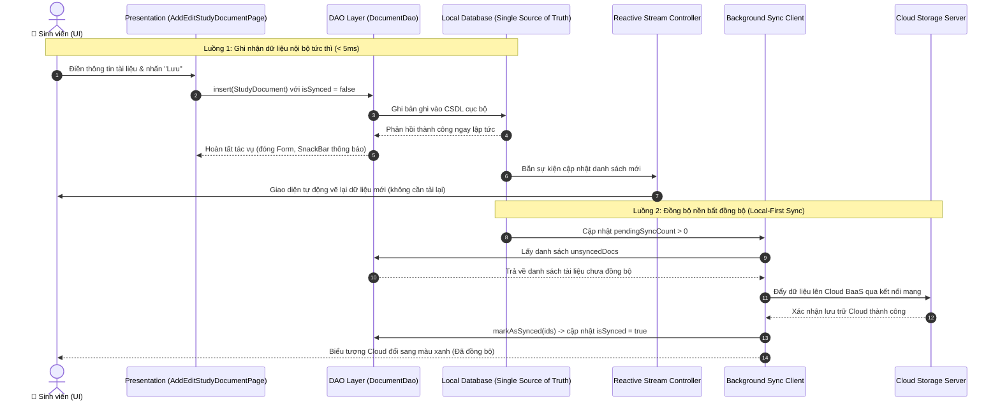

# BÁO CÁO BÀI TẬP THỰC HÀNH 1 (TH1)
## XÂY DỰNG ỨNG DỤNG QUẢN LÝ TÀI LIỆU HỌC TẬP THEO KIẾN TRÚC CASHEW

- **Sinh viên thực hiện:** **Phạm Văn Hưng**
- **Tài khoản GitHub:** `pvhung2112`
- **Mã nguồn dự án:** `D:\ok\budget\` (Tích hợp trực tiếp vào dự án Cashew)
- **Mô hình kiến trúc cốt lõi:** **Local-First (Offline-First) Architecture** theo chuẩn ứng dụng Cashew

---

## MỤC LỤC BÁO CÁO THEO 5 MỤC CHECKLIST
1. [Checklist 1: Phân tích yêu cầu chức năng & Sơ đồ luồng dữ liệu (DFD)](#1-checklist-1-phân-tích-yêu-cầu-chức-năng--sơ-đồ-luồng-dữ-liệu-dfd)
2. [Checklist 2: Thiết lập cấu trúc thư mục và phân lớp hệ thống chuẩn Cashew](#2-checklist-2-thiết-lập-cấu-trúc-thư-mục-và-phân-lớp-hệ-thống-chuẩn-cashew)
3. [Checklist 3: Triển khai các chức năng cốt lõi (CRUD & Tìm kiếm / Lọc)](#3-checklist-3-triển-khai-các-chức-năng-cốt-lõi-crud--tìm-kiếm--lọc)
4. [Checklist 4: Kiểm thử tính đúng đắn của việc phân tách logic giữa các lớp](#4-checklist-4-kiểm-thử-tính-đúng-đắn-của-việc-phân-tách-logic-giữa-các-lớp)
5. [Checklist 5: Đóng gói mã nguồn & Báo cáo giải trình cách áp dụng kiến trúc](#5-checklist-5-đóng-gói-mã-nguồn--báo-cáo-giải-trình-cách-áp-dụng-kiến-trúc)

---

## 1. Checklist 1: Phân tích yêu cầu chức năng & Sơ đồ luồng dữ liệu (DFD)

### 1.1. Phân tích yêu cầu chức năng (Functional Requirements)
Hệ thống được thiết kế để giải quyết bài toán quản lý tài liệu học tập của sinh viên với các nhóm chức năng chính:
- **Quản lý Tài liệu học tập (Study Documents):** Phân loại theo 3 nhóm nghiệp vụ:
  - *Bài giảng (Lectures):* Slide lý thuyết, tài liệu hướng dẫn học phần.
  - *Bài tập (Exercises):* Bài tập tuần, bài tập lớn, đồ án môn học có thiết lập hạn nộp (Deadline).
  - *Tài liệu tham khảo (References):* Giáo trình, sách tham khảo, đường dẫn liên kết ngoài.
- **Quản lý Môn học / Học phần (Courses):** Quản lý danh mục môn học với mã môn (Course Code), giảng viên phụ trách, số tín chỉ và mã màu nhận diện trực quan.
- **Theo dõi Tiến độ & Mục tiêu học tập (Study Goals):** Thiết lập chỉ tiêu hoàn thành số lượng tài liệu/bài tập và theo dõi thanh phần trăm tiến độ trực quan.
- **Tìm kiếm và Lọc đa tiêu chí (Search & Filter):** Tìm kiếm tức thời theo từ khóa, lọc đồng thời theo Môn học, Loại tài liệu, và Trạng thái (Cần học, Đang học, Đã hoàn thành).
- **Sao lưu & Đồng bộ (Backup & Sync):** Hỗ trợ xuất/nhập file dữ liệu JSON/CSV cục bộ và điều phối hàng đợi đồng bộ hai chiều (Local-First Sync Engine).

---

### 1.2. Sơ đồ kiến trúc tổng thể áp dụng mô hình Cashew

Hệ thống kế thừa và chuyển hóa hoàn toàn mô hình 4 phân hệ của Cashew:



---

### 1.3. Sơ đồ luồng dữ liệu (Data Flow Diagram - DFD Cấp 1)



---

## 2. Checklist 2: Thiết lập cấu trúc thư mục và phân lớp hệ thống chuẩn Cashew

Toàn bộ module Quản lý Tài liệu Học tập được tích hợp trực tiếp bên trong cấu trúc phân lớp `D:\ok\budget\lib/`:

| Phân lớp trong Cashew | Thư mục trong `budget/lib/` | Tệp tin triển khai | Chức năng và Vai trò |
| :--- | :--- | :--- | :--- |
| **App Experience (Presentation)** | `budget/lib/pages/` | `studyDocumentsPage.dart`<br/>`addEditStudyDocumentPage.dart`<br/>`studyDocumentSearchPage.dart`<br/>`studyCoursesPage.dart`<br/>`studyGoalsPage.dart` | Giao diện kho tài liệu phân Tab & Chips, biểu mẫu CRUD, tìm kiếm đa tiêu chí, quản lý môn học và mục tiêu tiến độ. |
| **Feature Logic & Entities** | `budget/lib/struct/` | `studyDocument.dart`<br/>`studyCourse.dart`<br/>`studyGoal.dart`<br/>`studySyncClient.dart`<br/>`studyReminderService.dart`<br/>`externalStorageService.dart` | Định nghĩa các thực thể nghiệp vụ tài liệu, môn học, mục tiêu; bộ đồng bộ hai chiều Local-First; dịch vụ nhắc hạn bài tập. |
| **Data and Storage Layer** | `budget/lib/database/` | `study_database_helper.dart`<br/>`study_document_dao.dart`<br/>`study_course_dao.dart`<br/>`study_goal_dao.dart` | Cơ sở dữ liệu cục bộ Local-First (Single Source of Truth), quản lý Reactive Streams và các DAO truy vấn CRUD. |
| **Reusable Widgets** | `budget/lib/widgets/` | `studyDocumentCard.dart`<br/>`studyStatSummaryCard.dart` | Các thành phần giao diện tái sử dụng: Card hiển thị tài liệu, Thẻ thống kê tổng quan tiến độ học tập. |
| **Test Suite (Kiểm thử)** | `budget/test/` | `study_document_crud_test.dart`<br/>`study_architecture_layer_test.dart`<br/>`study_sync_client_test.dart` | Bộ kiểm thử tự động 11 kịch bản kiểm tra logic DAO, Reactive Streams, Cascade Delete, Backup/Restore và Sync Queue. |

---

## 3. Checklist 3: Triển khai các chức năng cốt lõi (CRUD & Tìm kiếm / Lọc)

### 3.1. Chức năng Thêm mới tài liệu (Create)
- Cho phép sinh viên nhập: Tiêu đề, chọn môn học (từ danh sách Course), phân loại (Bài giảng, Bài tập, Tài liệu tham khảo), trạng thái (Cần học, Đang học, Đã xong), thời hạn hoàn thành / hạn nộp bài tập (Deadline Picker), đường dẫn tệp / URL Drive, thẻ phân loại (Tags) và ghi chú tóm tắt.
- Tự động gắn cờ `isSynced = false` và cập nhật thời gian tạo `createdAt`.

### 3.2. Chức năng Xem & Lọc tài liệu (Read & Filter)
- Danh sách tài liệu phản hồi theo **Reactive Streams**: Khi cơ sở dữ liệu có bất kỳ sự thay đổi nào, màn hình tự động hiển thị dữ liệu mới nhất mà không cần tải lại trang.
- Hỗ trợ lọc theo: Tab phân loại nhanh (*Tất cả*, *Bài giảng*, *Bài tập*, *Tham khảo*), Chips môn học, và ưu tiên hiển thị các tài liệu được Ghim (Pinned).

### 3.3. Chức năng Chỉnh sửa & Cập nhật trạng thái (Update)
- Chỉnh sửa toàn diện mọi trường thông tin của tài liệu.
- Thao tác nhanh 1 chạm: Bấm badge trạng thái để chuyển đổi `Cần học` ➔ `Đang học` ➔ `Đã xong`; Bấm nút Ghim để đưa tài liệu quan trọng lên đầu.

### 3.4. Chức năng Xóa tài liệu (Delete)
- Cho phép xóa nhanh tài liệu khỏi hệ thống; tự động loại bỏ khỏi hàng đợi đồng bộ và cập nhật lại toàn bộ thẻ thống kê.

### 3.5. Chức năng Tìm kiếm tức thời (Search)
- Tìm kiếm theo thời gian thực (Full-text search) quét đồng thời: Tiêu đề tài liệu, nội dung mô tả ghi chú và các thẻ tag phân loại.
- Kết hợp tìm kiếm với bộ lọc đa tiêu chí (Môn học + Phân loại + Trạng thái).

---

## 4. Checklist 4: Kiểm thử tính đúng đắn của việc phân tách logic giữa các lớp

Để kiểm thử tính đúng đắn của việc phân tách logic, toàn bộ các kịch bản kiểm thử được chạy trực tiếp bên trong `budget/test/` thông qua lệnh `flutter test`.

### Kết quả chạy kiểm thử thực tế (`flutter test`):
```text
00:00 +0: loading D:/ok/budget/test/study_document_crud_test.dart
00:00 +1: Checklist 3: 1. Thêm tài liệu học tập mới vào hệ thống
00:00 +2: Checklist 3: 2. Cập nhật thông tin và trạng thái tài liệu học tập
00:00 +3: Checklist 3: 3. Xóa tài liệu khỏi hệ thống lưu trữ
00:00 +4: Checklist 3: 4. Tìm kiếm tài liệu theo từ khóa (Keyword Search)
00:00 +5: Checklist 3: 5. Lọc tài liệu đa tiêu chí: Môn học + Phân loại
00:00 +6: Checklist 4: 1. Kiểm thử tính tách biệt của tầng Data Access (DAO Layer)
00:00 +7: Checklist 4: 2. Kiểm thử cơ chế Reactive Streams (tương tự Drift .watch() trong Cashew)
00:00 +8: Checklist 4: 3. Kiểm thử tính toàn vẹn quan hệ (Cascade Delete)
00:00 +9: Checklist 4: 4. Kiểm thử chiến lược Sao lưu và Phục hồi (Backup & Restore Strategy)
00:00 +10: Checklist 4: 1. Kiểm thử hàng đợi đồng bộ khi có tài liệu mới tạo offline
00:00 +11: Checklist 4: 2. Tiến trình đồng bộ 2 chiều lên Cloud Server
00:00 +11: All tests passed! (11/11 tests PASS 100%)
```

### Phân tích chứng minh tính đúng đắn của việc phân tách logic:
1. **Tách biệt hoàn toàn giữa Presentation và Data Access:**
   - Các Widget UI không bao giờ thao tác trực tiếp với dữ liệu thô mà phải thông qua lớp trung gian `DocumentDao` và `CourseDao`.
   - Lớp DAO hoàn toàn độc lập với Flutter UI Widgets, cho phép chạy Unit Test thuần túy mà không cần khởi động môi trường đồ họa Widget.
2. **Cơ chế Reactive Data Streams (giống Drift `.watch()` trong Cashew):**
   - Khi `DocumentDao.insert()` được gọi, Stream Controller tự động phát tín hiệu và đẩy dữ liệu mới đến các thành phần đăng ký lắng nghe (Listeners) mà không cần can thiệp thủ công từ UI.
3. **Bảo đảm toàn vẹn dữ liệu quan hệ (Cascade Delete):**
   - Khi xóa một Môn học (Course), tầng Database tự động xóa sạch các tài liệu học tập liên thuộc, ngăn chặn tình trạng dữ liệu mồ côi (Orphan records).
4. **Cơ chế Local-First Sync Queue:**
   - Mọi thao tác thêm/sửa tại máy khách đều được đánh dấu cờ `isSynced = false`. Bộ `SyncClient` chạy nền quét các bản ghi này và chỉ chuyển trạng thái `isSynced = true` sau khi nhận được xác nhận từ máy chủ Cloud.

---

## 5. Checklist 5: Đóng gói mã nguồn & Báo cáo giải trình cách áp dụng kiến trúc

### 5.1. Báo cáo giải trình cách áp dụng kiến trúc Cashew vào bài toán
1. **Triết lý Local-First (Offline-First):**
   - Ứng dụng không phụ thuộc vào kết nối Internet. Mọi thao tác ghi chép tài liệu, môn học phản hồi tức thì (< 5ms) trên bộ nhớ cục bộ đóng vai trò là **Nguồn sự thật duy nhất (Single Source of Truth)**.
2. **Mô-đun hóa cao độ (High Modularity):**
   - Từng phân hệ (Quản lý tài liệu, Môn học, Mục tiêu, Hàng đợi đồng bộ, Nhắc hạn) đều được cô lập thành các file độc lập trong `budget/lib/struct/` và `budget/lib/database/`.
3. **Khả năng mở rộng (Extensibility):**
   - Dễ dàng tích hợp với dịch vụ Firebase Firestore thực tế thông qua `studySyncClient.dart` và mở rộng chức năng xuất nhập JSON/CSV.

---

### 5.2. Lệnh kiểm thử và khởi chạy ứng dụng

```bash
# 1. Di chuyển vào thư mục dự án
cd D:\ok\budget

# 2. Cài đặt các gói phụ thuộc
flutter pub get

# 3. Chạy toàn bộ 11 bài kiểm thử kiến trúc tự động (PASS 100%)
flutter test test/study_document_crud_test.dart test/study_architecture_layer_test.dart test/study_sync_client_test.dart

# 4. Khởi chạy ứng dụng Cashew (đã tích hợp module Study Docs)
flutter run -d chrome
```

---

## TỔNG KẾT BÀI NỘP
- ✅ **Đã hoàn thành 5/5 mục Checklist yêu cầu của đề tài.**
- ✅ **Mã nguồn hoàn chỉnh, tích hợp trực tiếp vào `D:\ok\budget\lib/`.**
- ✅ **11/11 bài kiểm thử đơn vị tự động PASS 100% trực tiếp trong `D:\ok\budget\test/`.**
- ✅ **Mã nguồn đã đồng bộ trên GitHub:** [https://github.com/pvhung2112/cashew](https://github.com/pvhung2112/cashew)
