# 📊 BÁO CÁO PHÂN TÍCH KIẾN TRÚC HỆ THỐNG ỨNG DỤNG CASHEW

<div align="center">
  <h3><b>Đề tài: Nghiên cứu và phân tích chi tiết kiến trúc kỹ thuật ứng dụng Cashew</b></h3>
  <p><b>Sinh viên thực hiện:</b> Phạm Văn Hưng (<code>pvhung2112</code>)</p>
  <p>
    <a href="https://github.com/pvhung2112/cashew"></a>
    <a href="https://gitdiagram.com/pvhung2112/cashew"></a>
    <a href="./BAO_CAO_KIEN_TRUC_CASHEW.md"></a>
    
  </p>
</div>

---

## 📌 Liên kết quan trọng phục vụ chấm bài
- 🌐 **Sơ đồ kiến trúc tương tác trực tuyến (GitDiagram):** [https://gitdiagram.com/pvhung2112/cashew](https://gitdiagram.com/pvhung2112/cashew)
- 📑 **Báo cáo phân tích kiến trúc đầy đủ (5 mục Checklist):** [Xem file BAO_CAO_KIEN_TRUC_CASHEW.md](./BAO_CAO_KIEN_TRUC_CASHEW.md)
- 📂 **Mã nguồn thực tế đã kiểm thử và cấu hình:** [https://github.com/pvhung2112/cashew](https://github.com/pvhung2112/cashew)

---

## 📋 Đánh giá theo Checklist yêu cầu đề bài (5/5 mục)

| STT | Yêu cầu Checklist | Nội dung thực hiện & Minh chứng | Trạng thái |
| :---: | :--- | :--- | :---: |
| **1** | **Nghiên cứu & vẽ sơ đồ kiến trúc tổng thể** | Xây dựng sơ đồ phân tầng tương tác trực quan 4 khối + API bên ngoài; trực quan hóa trên [GitDiagram](https://gitdiagram.com/pvhung2112/cashew) và sơ đồ Mermaid. | ✅ Hoàn thành |
| **2** | **Phân tích chi tiết các thành phần CNTT** | Mổ xẻ chi tiết tầng Frontend (Flutter), tầng Backend/BaaS (Firebase Firestore, Auth), Network Layer & Gateway tích hợp tỷ giá tiền tệ. | ✅ Hoàn thành |
| **3** | **Đánh giá giải pháp lưu trữ dữ liệu** | Phân tích cơ sở dữ liệu quan hệ cục bộ SQLite thông qua Drift ORM; đánh giá cấu trúc thực thể (ERD) và chiến lược sao lưu Local JSON/Google Drive. | ✅ Hoàn thành |
| **4** | **Mô tả luồng dữ liệu UI → Storage** | Trực quan hóa Sequence Diagram cho luồng ghi chép giao dịch tài chính nội bộ (< 5ms) và luồng đồng bộ hai chiều bất đồng bộ lên Cloud Firestore. | ✅ Hoàn thành |
| **5** | **Báo cáo tổng kết & Đề xuất cải tiến** | Đánh giá ưu/nhược điểm kiến trúc Local-First; đề xuất 4 giải pháp: Clean Architecture & BLoC, CRDT Sync Engine, Mã hóa đầu cuối (E2EE) và Open Banking API. | ✅ Hoàn thành |

---

## 🏛️ Sơ đồ kiến trúc tổng thể hệ thống (System Architecture Diagram)

```mermaid
graph TB
    %% ==========================================
    %% Định nghĩa Style màu sắc
    %% ==========================================
    classDef userClass fill:#d0e1fd,stroke:#4a86e8,stroke-width:2px,color:#000;
    classDef serviceClass fill:#ffd2d2,stroke:#e06666,stroke-width:1.5px,color:#000;
    classDef appClass fill:#cfe2f3,stroke:#6fa8dc,stroke-width:1.5px,color:#000;
    classDef financeClass fill:#fce5cd,stroke:#e69138,stroke-width:1.5px,color:#000;
    classDef storageClass fill:#d9ead3,stroke:#6aa84f,stroke-width:1.5px,color:#000;
    classDef apiClass fill:#d9d2e9,stroke:#8e7cc3,stroke-width:1.5px,color:#000;

    %% Actor trung tâm
    User(("👤 User<br/>(Người dùng)")):::userClass

    %% KHỐI 1: Connected Services
    subgraph ConnectedServices [" ☁️ Connected services "]
        SyncClient["Sync client<br/><b>[lib/struct/syncClient.dart]</b>"]:::serviceClass
        FirebaseServices["Firebase services<br/><b>[Auth, Firestore, Storage]</b>"]:::serviceClass
        Notifications["Notifications<br/><b>[lib/struct/notificationsGlobal.dart]</b>"]:::serviceClass
    end

    %% KHỐI 2: App Experience
    subgraph AppExperience [" 📱 App experience "]
        FlutterApp["Flutter app<br/><b>[lib/main.dart]</b>"]:::appClass
        HomeDashboard["Home dashboard<br/><b>[lib/pages/homePage/homePage.dart]</b>"]:::appClass
    end

    %% KHỐI 3: Finance Features
    subgraph FinanceFeatures [" 💰 Finance features "]
        SearchFilter["Search and filters<br/><b>[lib/pages/transactionsSearchPage.dart]</b>"]:::financeClass
        CurrencyConv["Currency conversion<br/><b>[lib/struct/currencyFunctions.dart]</b>"]:::financeClass
        Transactions["Transactions<br/><b>[lib/pages/addTransactionPage.dart]</b>"]:::financeClass
        Budgets["Budgets<br/><b>[lib/pages/budgetPage.dart]</b>"]:::financeClass
        Goals["Goals<br/><b>[lib/pages/objectivePage.dart]</b>"]:::financeClass
        Accounts["Accounts<br/><b>[lib/pages/accountsPage.dart]</b>"]:::financeClass
        SpendingInsights["Spending Insights<br/><b>[lib/pages/homePage/homePagePieChart.dart]</b>"]:::financeClass
    end

    %% KHỐI 4: External API
    ExchangeRateService["Exchange-rate service<br/><b>[fawazahmed0 currency API]</b>"]:::apiClass

    %% KHỐI 5: Data and Storage
    subgraph DataAndStorage [" 💾 Data and storage "]
        CSVEngine["CSV import/export<br/><b>[lib/widgets/importCSV.dart]</b>"]:::storageClass
        BackupRestore["Backup and restore<br/><b>[lib/widgets/accountAndBackup.dart]</b>"]:::storageClass
        DriftDB[("drift database<br/><b>[lib/database/tables.dart]</b>")]:::storageClass
    end

    %% Luồng tương tác
    SyncClient -->|"uses"| FirebaseServices
    SyncClient -->|"uses"| Notifications
    SyncClient -->|"sends reminders"| User
    SyncClient <-->|"syncs data"| DriftDB

    User -->|"uses"| FlutterApp
    FlutterApp -->|"shows"| HomeDashboard
    HomeDashboard -->|"shows summaries"| FinanceFeatures

    User -->|"searches"| SearchFilter
    User -->|"records"| Transactions
    User -->|"sets budgets"| Budgets
    User -->|"sets goals"| Goals
    User -->|"manages"| Accounts

    CurrencyConv -->|"gets rates"| ExchangeRateService
    Transactions -->|"stores transactions"| DriftDB
    Budgets -->|"stores budgets"| DriftDB
    Goals -->|"stores goals"| DriftDB
    Accounts -->|"stores accounts"| DriftDB
    SpendingInsights -->|"reads finance data"| DriftDB

    CSVEngine -->|"imports and exports"| DriftDB
    BackupRestore -->|"backs up data"| DriftDB
```



---

## 🔍 Phân tích các thành phần cốt lõi trong hệ thống

### 1. Triết lý kiến trúc Local-First (Offline-First)
Cashew áp dụng kiến trúc **Local-First**, trong đó cơ sở dữ liệu SQLite cục bộ (thông qua Drift ORM) đóng vai trò là **Nguồn sự thật duy nhất (Single Source of Truth)**:
- Mọi thao tác thêm/sửa/xóa giao dịch được thực hiện trực tiếp vào SQLite với độ trễ cực thấp (< 5ms), hoạt động hoàn hảo 100% khi không có mạng (Offline).
- Khi có kết nối mạng, module `syncClient.dart` sẽ chạy nền (asynchronous background worker) để đẩy dữ liệu lên Cloud Firestore và kéo các thay đổi mới về.

### 2. Các tầng công nghệ (Tech Stack)
- **Frontend / Client UI:** Flutter SDK (Dart), kiến trúc Widget đa nền tảng (Android, iOS, Web, Desktop), UI responsive thích ứng điện thoại và máy tính bảng.
- **Local Persistence Layer:** SQLite engine với thư viện Drift (Moor), hỗ trợ Type-Safe queries, Schema Migrations và Reactive Streams (`watch()`).
- **Backend-as-a-Service (BaaS):** Google Firebase:
  - *Firebase Authentication:* Định danh người dùng.
  - *Cloud Firestore:* Cơ sở dữ liệu NoSQL lưu trữ bản sao dự phòng và điều phối đồng bộ đa thiết bị.
  - *Firebase Storage:* Lưu trữ tệp sao lưu dữ liệu lớn.
- **External Integration:** Tích hợp RESTful API miễn phí `cdn.jsdelivr.net/gh/fawazahmed0/currency-api` để cập nhật tỷ giá hối đoái tiền tệ thế giới.

---

## 🚀 Hướng dẫn cài đặt và chạy ứng dụng

Để chạy thử nghiệm ứng dụng Cashew trên môi trường cục bộ:

```bash
# 1. Di chuyển vào thư mục ứng dụng
cd budget

# 2. Cài đặt các gói phụ thuộc (Dependencies)
flutter pub get

# 3. Khởi chạy ứng dụng trên trình duyệt Chrome (Web Platform)
flutter run -d chrome

# Hoặc khởi chạy trên thiết bị di động / máy ảo Android
flutter run
```

---

## 👨‍💻 Thông tin tác giả
- **Sinh viên:** Phạm Văn Hưng
- **GitHub:** [@pvhung2112](https://github.com/pvhung2112)
- **Mã nguồn Repository:** [https://github.com/pvhung2112/cashew](https://github.com/pvhung2112/cashew)
